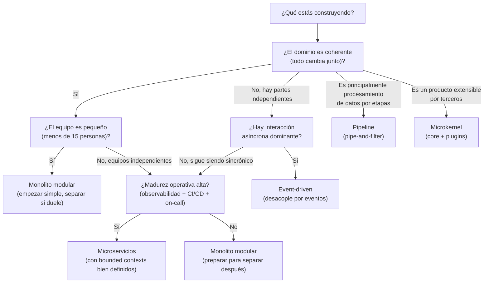

# Síntesis y árbol de decisión

## Tensión

Al principio de esta sección, en `00_index.md`, te pedí escribir una oración que complete:

> *"Una arquitectura es buena cuando ______."*

Saca esa oración. Léela. **¿Cambiarías algo?**

Si no cambiarías nada, probablemente la sección no te dejó nada. Si cambiarías todo, probablemente perdiste lo que tenías.

La respuesta más interesante suele ser: *"Cambio **algunas palabras** — las que antes eran vagas (*'buena'*, *'funciona'*, *'elegante'*) ahora tienen nombres específicos (*'optimiza estas 3 características'*, *'defendibles con un ADR'*, *'sobrevive rotación'*)."*

Esa diferencia es lo que aprendiste.

---

## El through-line: el mismo chatbot, 4 capas de anotación

En todo el curso hemos ido anotando el mismo sistema con capas distintas. Esta es la versión combinada:

- **§16** definió **qué corre dónde** (compute).
- **§18** definió **cómo se hablan** las cajas (protocolos).
- **§19** definió **contratos durables** sobre las flechas.
- **§20** definió **características** sobre las cajas y **decisiones** sobre el sistema.

Cada sección **no reemplazó** la anterior — la **sobrescribió** con una capa más. Un arquitecto competente lee las 4 capas simultáneamente.

---

## El árbol de decisión (en español)

No es un flowchart que garantiza un estilo. Es una **secuencia de preguntas** que tu equipo se hace. Cada pregunta abre ramas, y cada rama viene con un grupo de estilos más probables. El estilo final se defiende con un ADR.

El árbol no reemplaza el proceso de la lección 08. Es una **herramienta de primera aproximación**. Después del árbol, siempre viene la triangulación (características + dominio + equipo) y el ADR.

---

## Heat map — estilos × características

¿Qué estilos son mejores para qué características? La respuesta no es binaria ("bueno / malo") — son sombreados:

| Característica | Layered | Monolito modular | Pipeline | Event-driven | Microkernel | Microservicios |
|----------------|---------|------------------|----------|--------------|-------------|----------------|
| Simplicidad operativa | ●●● | ●●●● | ●●● | ●● | ●●● | ● |
| Time-to-market | ●● | ●●●● | ●●● | ●● | ●● | ● |
| Modificabilidad | ●● | ●●● | ●●●● | ●●●● | ●●● | ●●●● |
| Escalabilidad por componente | ● | ● | ●● | ●●●● | ●● | ●●●●● |
| Extensibilidad por terceros | ● | ● | ●● | ●● | ●●●●● | ●●● |
| Testabilidad | ●●●● | ●●●● | ●●●●● | ●●● | ●●● | ●●● |
| Tolerancia a fallos | ● | ●● | ●●● | ●●●● | ●●● | ●●●● |
| Aislamiento de compliance | ● | ●● | ●● | ●● | ●●● | ●●●●● |
| Desacople de equipos | ● | ●● | ●●● | ●●●● | ●●● | ●●●●● |

**Cómo leerlo**: los puntos no son "ranking global" — son **tendencias**. Un modular monolith bien hecho puede superar a microservicios en **modificabilidad** si el dominio es coherente. Microservicios pobremente implementados pierden sus ganancias en escalabilidad. El heat map **orienta**; el contexto **decide**.

---

## Los 3 katas de la sección, en una vista

Esta sección tuvo 3 katas graded ({:graded} en la notación del curso):

1. **`20.1`** — elegir 5 características para el chatbot y defender 20 exclusiones (lección 03)
2. **`20.2`** — escribir el ADR-0007 para el storage del chatbot (lección 04)
3. **`20.3`** — elegir un estilo para el chatbot y escribir el ADR completo (lección 08)

Los tres apuntan al mismo músculo: **hacer legible un razonamiento bajo ambigüedad**.

- En `20.1`, defiendes qué no optimizas.
- En `20.2`, defiendes qué sacrificas.
- En `20.3`, defiendes qué forma eliges.

Los tres se evalúan por **legibilidad del razonamiento**, no por "la respuesta correcta". Cuando los 3 están escritos, tienes una caja de herramientas para defender cualquier decisión arquitectónica futura del mismo tipo — en el trabajo, en un proyecto, en una entrevista.

---

## Las 6 ideas que llevarte

Si lo demás se te olvida, estas 6 deberían sobrevivir:

1. **Arquitectura ≠ stack.** La arquitectura es *estilo + características + componentes + decisiones*. Los nombres de tecnologías son implementación.
2. **Todo en arquitectura es trade-off.** Si no ves el costo, no lo detectaste.
3. **Elige pocas características, no muchas.** Prioriza 3–7. Defiende qué **no** optimizas.
4. **Los ADRs son el artefacto durable.** Context + Decision + Consequences + Notes. Sin Consequences, no hay ADR.
5. **Distribuido no es default.** Revisa las 11 falacias antes de romper un monolito. El modular monolith es la respuesta honesta para la mayoría de los equipos pequeños.
6. **El por qué importa más que el cómo.** El cómo está en el código. El por qué se pierde si no lo escribes.

---

## Concepto nombrado

Esta sección te dio un **lenguaje** para razonar sobre arquitectura. No te hizo arquitecto. Los arquitectos se forman con años de tomar decisiones, ver las que fallaron, y aprender a nombrar por qué.

Pero el lenguaje es el paso uno. Sin el vocabulario, las decisiones son intuición — y la intuición sin vocabulario **no es transferible**: no la puedes explicar, no la puedes defender, no la puedes enseñar al siguiente.

Con el vocabulario, las decisiones se vuelven **argumentos**. Y los argumentos pueden mejorarse, criticarse, superarse.

---

## Pregunta del por qué (la última)

Vuelve a leer tu respuesta del primer día:

> *"Una arquitectura es buena cuando ______."*

Ahora reescríbela con el vocabulario que tienes. Comparando:

- ¿Cuáles palabras vagas tienen ahora nombres específicos?
- ¿Qué ahora dirías que **no** hace buena a una arquitectura (y antes no tenías vocabulario para descartar)?
- ¿Hay alguna decisión que antes habrías descrito en términos de "stack" y que ahora describirías en términos de "características" o "decisiones"?

---

:::exercise{title="Cierra con una oración"}
Completa de nuevo, **con el vocabulario de la sección**, la oración:

> *"Esta arquitectura es la correcta porque ______."*

para el estilo que elegiste en el kata `20.3`.

La oración debe nombrar:

1. Una característica arquitectónica que el estilo optimiza.
2. Una característica que estás dispuesto a sacrificar.
3. La restricción principal (dominio o equipo) que forzó el trade-off.

Todo en una sola oración. Sin rodeos.

**No se evalúa.** Es un ejercicio de cierre — para notar si ahora puedes decir, en una oración, lo que al principio hubieras dicho en un párrafo confuso.
:::

---

## Qué sigue

Esta sección cerró el bloque de **cómo pensar sistemas** del curso. Con §16-§19 tienes el vocabulario técnico; con §20 tienes el vocabulario arquitectónico. Lo que sigue en tu formación no es otra sección — es **práctica real**.

Las formas concretas de seguir:

- Leer ADRs reales en codebases abiertas (Django, Kubernetes, Postgres publican ADRs).
- Escribir uno cada vez que tu equipo (en trabajo, en un proyecto del curso) tome una decisión arquitectónica.
- Cuando veas un estilo en la naturaleza, aplica el heat map — *"¿qué están optimizando? ¿qué sacrifican?"*.

La segunda edición de Richards & Ford (el libro en el que se basa esta sección, en `clase/libros/`) es un buen siguiente paso si esta sección te gustó. No trates de leerlo completo; úsalo como referencia cuando te topes con un estilo concreto en el trabajo.

Y cuando alguien te diga *"¿qué arquitectura usarías para X?"*, ya sabes qué responder.
